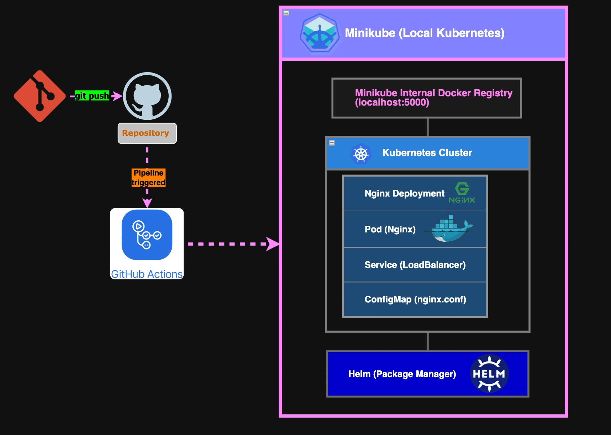

# 🚀 Nginx Application with Minikube & CI/CD Pipeline

This project demonstrates a **fully automated CI/CD pipeline** using **GitHub Actions, Docker, Minikube, and Helm** to build, deploy, and manage an Nginx-based application in a local Kubernetes environment.

---

## 📌 Overview

The workflow performs the following steps:  
✅ **Build & Tag** the Docker image for the Nginx app  
✅ **Push the image** to Minikube's internal registry  
✅ **Update Helm values** to reflect the new image version  
✅ **Deploy to Minikube** using Helm  
✅ **Verify Deployment** and troubleshoot issues automatically  

---

## 📜 Architecture

  

The system consists of:  
- **Minikube**: A lightweight Kubernetes cluster for local development  
- **Docker Buildx**: A powerful build tool for multi-platform Docker images  
- **Helm**: Kubernetes package manager for streamlined application deployment  
- **GitHub Actions**: CI/CD automation for continuous deployment  

---

## 📂 Project Structure

| 📁 Path | 📄 Description |
|---------|--------------|
| [`./nginx/`](./nginx/) | Contains the Dockerfile for building the Nginx image, HTML file for the image, nginx.conf configuration file |
| [`./nginx-app/`](./nginx-app/) | Helm chart for deploying the application |
| [`./nginx-app/values.yaml`](./nginx-app/values.yaml) | Configures the Kubernetes deployment |
| [`.github/workflows/ci-cd.yml`](.github/workflows/ci-cd.yml) | GitHub Actions CI/CD pipeline |

---

## 🛠️ Prerequisites

Before running the pipeline locally, ensure you have:  
- **Docker** installed and running  
- **Minikube** installed
- **Helm** installed

---

## 🚀 CI/CD Pipeline

This project uses **GitHub Actions** to automate the deployment process. The pipeline triggers **on every push to `main`**, performing the following steps:

### 📦 Build & Push Image
- Configures Minikube and sets up the Docker environment
- Builds the Nginx image and pushes it to Minikube's internal registry

### 🔄 Update Image Tag in `values.yaml`
- Automatically updates the **Helm values file** with the latest image version
- Commits and pushes changes if necessary

### ⛵ Deploy Using Helm
- Deploys or upgrades the Helm release on Minikube
- Ensures the **latest image** is used in the deployment

### ✅ Verification & Troubleshooting
- Lists **running pods & services**  
- Fetches logs if deployment fails  

---

